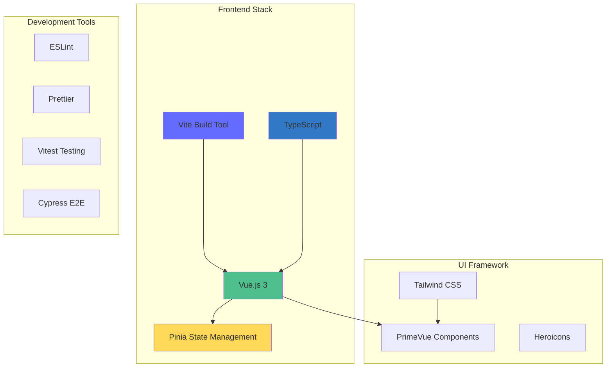
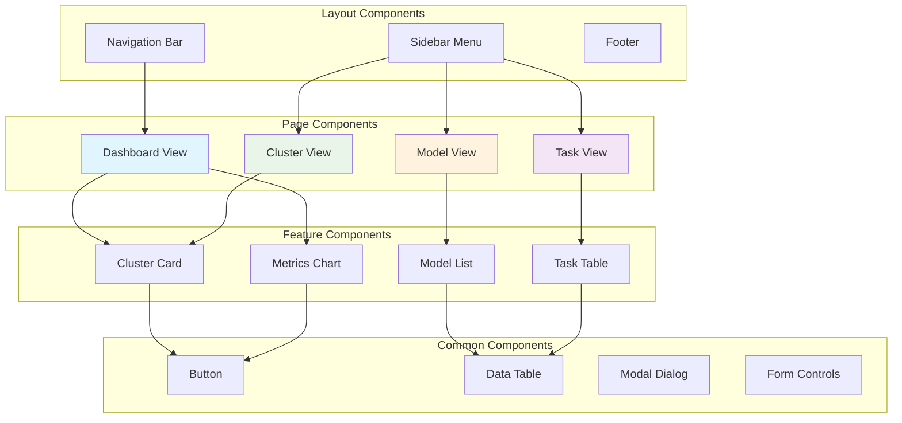
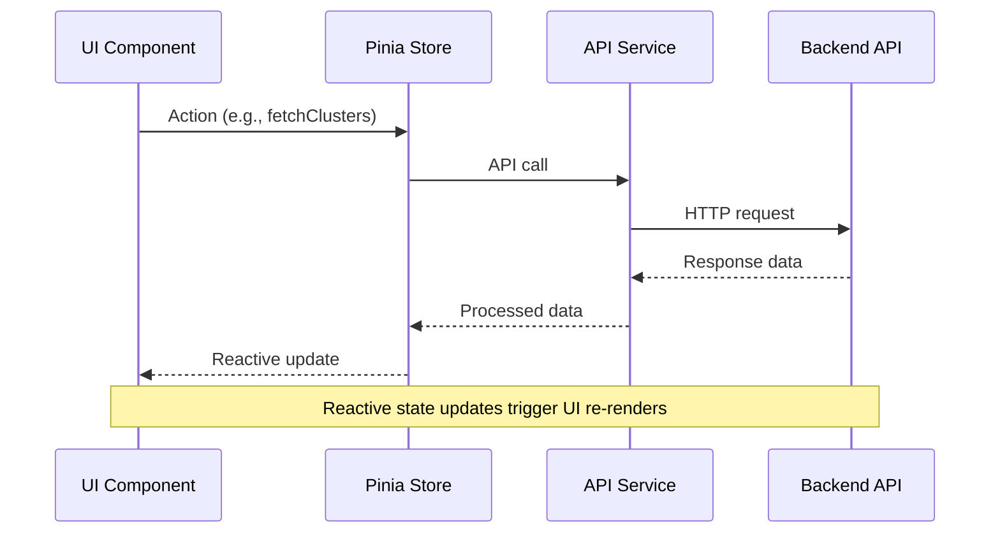

# Web UI Architecture

## Overview

The BitingLip Web UI is a modern Vue.js 3 application built with Vite, providing a responsive and intuitive interface for managing the AI inference platform. The frontend follows component-based architecture with TypeScript support and modern development practices.

## Technology Stack

### Core Framework


### Dependencies
- **Vue 3**: Composition API with `<script setup>` syntax
- **Vite**: Fast development server and build tool
- **TypeScript**: Type safety and enhanced developer experience
- **Pinia**: Vuex alternative for state management
- **PrimeVue**: Comprehensive UI component library
- **Tailwind CSS**: Utility-first CSS framework
- **Axios**: HTTP client for API communication
- **Vue Router**: Client-side routing
- **Chart.js**: Data visualization for metrics

## Application Architecture

### Directory Structure
```
src/
├── components/           # Reusable UI components
│   ├── common/          # Generic components
│   ├── cluster/         # Cluster-specific components
│   ├── models/          # Model management components
│   ├── tasks/           # Task monitoring components
│   └── charts/          # Data visualization components
├── views/               # Page-level components
│   ├── Dashboard.vue    # Main dashboard
│   ├── Clusters.vue     # Cluster management
│   ├── Models.vue       # Model browser
│   ├── Tasks.vue        # Task monitoring
│   └── Settings.vue     # Configuration
├── stores/              # Pinia stores
│   ├── auth.ts          # Authentication state
│   ├── cluster.ts       # Cluster data
│   ├── models.ts        # Model registry
│   └── tasks.ts         # Task queue state
├── services/            # API communication
│   ├── api.ts           # Base API client
│   ├── cluster.ts       # Cluster API calls
│   ├── models.ts        # Model API calls
│   └── tasks.ts         # Task API calls
├── types/               # TypeScript definitions
├── utils/               # Utility functions
├── router/              # Route definitions
└── assets/              # Static assets
```

### Component Architecture



## State Management

### Pinia Store Structure

#### Authentication Store (`stores/auth.ts`)
```typescript
export const useAuthStore = defineStore('auth', () => {
  const user = ref<User | null>(null)
  const token = ref<string | null>(null)
  const isAuthenticated = computed(() => !!token.value)
  
  async function login(credentials: LoginCredentials) {
    const response = await authApi.login(credentials)
    token.value = response.token
    user.value = response.user
    localStorage.setItem('auth_token', response.token)
  }
  
  function logout() {
    token.value = null
    user.value = null
    localStorage.removeItem('auth_token')
  }
  
  return {
    user: readonly(user),
    token: readonly(token),
    isAuthenticated,
    login,
    logout
  }
})
```

#### Cluster Store (`stores/cluster.ts`)
```typescript
export const useClusterStore = defineStore('cluster', () => {
  const clusters = ref<Cluster[]>([])
  const activeCluster = ref<Cluster | null>(null)
  const workers = ref<Worker[]>([])
  const loading = ref(false)
  
  async function fetchClusters() {
    loading.value = true
    try {
      clusters.value = await clusterApi.getClusters()
    } finally {
      loading.value = false
    }
  }
  
  async function fetchWorkers(clusterId: string) {
    workers.value = await clusterApi.getWorkers(clusterId)
  }
  
  function selectCluster(cluster: Cluster) {
    activeCluster.value = cluster
    fetchWorkers(cluster.id)
  }
  
  return {
    clusters: readonly(clusters),
    activeCluster: readonly(activeCluster),
    workers: readonly(workers),
    loading: readonly(loading),
    fetchClusters,
    fetchWorkers,
    selectCluster
  }
})
```

### Data Flow



## API Integration

### Base API Client (`services/api.ts`)
```typescript
import axios, { AxiosInstance, AxiosRequestConfig } from 'axios'
import { useAuthStore } from '@/stores/auth'

class ApiClient {
  private client: AxiosInstance
  
  constructor(baseURL: string) {
    this.client = axios.create({
      baseURL,
      timeout: 10000,
      headers: {
        'Content-Type': 'application/json'
      }
    })
    
    this.setupInterceptors()
  }
  
  private setupInterceptors() {
    // Request interceptor for auth token
    this.client.interceptors.request.use((config) => {
      const authStore = useAuthStore()
      if (authStore.token) {
        config.headers.Authorization = `Bearer ${authStore.token}`
      }
      return config
    })
    
    // Response interceptor for error handling
    this.client.interceptors.response.use(
      (response) => response,
      (error) => {
        if (error.response?.status === 401) {
          const authStore = useAuthStore()
          authStore.logout()
        }
        return Promise.reject(error)
      }
    )
  }
  
  async get<T>(url: string, config?: AxiosRequestConfig): Promise<T> {
    const response = await this.client.get(url, config)
    return response.data
  }
  
  async post<T>(url: string, data?: any, config?: AxiosRequestConfig): Promise<T> {
    const response = await this.client.post(url, data, config)
    return response.data
  }
  
  // Additional HTTP methods...
}

export const apiClient = new ApiClient(import.meta.env.VITE_API_URL)
```

### Real-time Updates

#### WebSocket Integration
```typescript
export class WebSocketService {
  private ws: WebSocket | null = null
  private reconnectAttempts = 0
  private maxReconnectAttempts = 5
  
  connect(url: string) {
    this.ws = new WebSocket(url)
    
    this.ws.onopen = () => {
      console.log('WebSocket connected')
      this.reconnectAttempts = 0
    }
    
    this.ws.onmessage = (event) => {
      const data = JSON.parse(event.data)
      this.handleMessage(data)
    }
    
    this.ws.onclose = () => {
      console.log('WebSocket disconnected')
      this.attemptReconnect()
    }
    
    this.ws.onerror = (error) => {
      console.error('WebSocket error:', error)
    }
  }
  
  private handleMessage(data: any) {
    switch (data.type) {
      case 'cluster_update':
        const clusterStore = useClusterStore()
        clusterStore.updateCluster(data.payload)
        break
      case 'task_update':
        const taskStore = useTaskStore()
        taskStore.updateTask(data.payload)
        break
    }
  }
  
  private attemptReconnect() {
    if (this.reconnectAttempts < this.maxReconnectAttempts) {
      this.reconnectAttempts++
      setTimeout(() => {
        this.connect(this.getWebSocketUrl())
      }, 2000 * this.reconnectAttempts)
    }
  }
}
```

## UI Components

### Design System

#### Theme Configuration
```typescript
// tailwind.config.js
export default {
  content: ['./src/**/*.{vue,js,ts}'],
  theme: {
    extend: {
      colors: {
        primary: {
          50: '#eff6ff',
          500: '#3b82f6',
          900: '#1e3a8a'
        },
        success: {
          50: '#f0fdf4',
          500: '#22c55e',
          900: '#14532d'
        },
        warning: {
          50: '#fffbeb',
          500: '#f59e0b',
          900: '#78350f'
        },
        error: {
          50: '#fef2f2',
          500: '#ef4444',
          900: '#7f1d1d'
        }
      },
      spacing: {
        '18': '4.5rem',
        '88': '22rem'
      }
    }
  },
  plugins: []
}
```

#### Component Library Structure
```
components/
├── common/
│   ├── BaseButton.vue      # Primary button component
│   ├── BaseCard.vue        # Card container
│   ├── BaseTable.vue       # Data table with sorting/filtering
│   ├── BaseModal.vue       # Modal dialog
│   └── BaseForm.vue        # Form wrapper with validation
├── charts/
│   ├── LineChart.vue       # Time series charts
│   ├── BarChart.vue        # Bar charts for metrics
│   ├── PieChart.vue        # Distribution charts
│   └── GaugeChart.vue      # Performance gauges
├── cluster/
│   ├── ClusterCard.vue     # Cluster status card
│   ├── ClusterList.vue     # Cluster grid/list view
│   ├── WorkerStatus.vue    # Individual worker status
│   └── ClusterMetrics.vue  # Cluster performance metrics
├── models/
│   ├── ModelBrowser.vue    # Model repository browser
│   ├── ModelCard.vue       # Model information card
│   ├── ModelUpload.vue     # Model upload interface
│   └── ModelMetrics.vue    # Model performance metrics
└── tasks/
    ├── TaskQueue.vue       # Task queue visualization
    ├── TaskDetails.vue     # Detailed task information
    ├── TaskHistory.vue     # Historical task data
    └── TaskMetrics.vue     # Task performance metrics
```

### Responsive Design

#### Breakpoint Strategy
```scss
// Mobile-first responsive design
.component {
  // Mobile (default)
  @apply text-sm p-2;
  
  // Tablet
  @screen md {
    @apply text-base p-4;
  }
  
  // Desktop
  @screen lg {
    @apply text-lg p-6;
  }
  
  // Large desktop
  @screen xl {
    @apply text-xl p-8;
  }
}
```

#### Layout Components
```vue
<!-- ResponsiveLayout.vue -->
<template>
  <div class="min-h-screen bg-gray-50 dark:bg-gray-900">
    <!-- Mobile header -->
    <header class="lg:hidden bg-white dark:bg-gray-800 shadow">
      <MobileNavigation />
    </header>
    
    <div class="flex">
      <!-- Desktop sidebar -->
      <aside class="hidden lg:flex lg:flex-shrink-0">
        <DesktopSidebar />
      </aside>
      
      <!-- Main content -->
      <main class="flex-1 min-w-0">
        <div class="px-4 sm:px-6 lg:px-8 py-6">
          <router-view />
        </div>
      </main>
    </div>
  </div>
</template>
```

## Performance Optimization

### Code Splitting

#### Route-based Splitting
```typescript
// router/index.ts
const routes = [
  {
    path: '/',
    name: 'Dashboard',
    component: () => import('@/views/Dashboard.vue')
  },
  {
    path: '/clusters',
    name: 'Clusters',
    component: () => import('@/views/Clusters.vue')
  },
  {
    path: '/models',
    name: 'Models',
    component: () => import('@/views/Models.vue')
  }
]
```

#### Component Lazy Loading
```vue
<script setup lang="ts">
import { defineAsyncComponent } from 'vue'

// Lazy load heavy components
const HeavyChart = defineAsyncComponent(
  () => import('@/components/charts/HeavyChart.vue')
)

const showChart = ref(false)
</script>

<template>
  <div>
    <button @click="showChart = true">Show Chart</button>
    <Suspense v-if="showChart">
      <HeavyChart />
      <template #fallback>
        <div>Loading chart...</div>
      </template>
    </Suspense>
  </div>
</template>
```

### Data Optimization

#### Virtual Scrolling for Large Lists
```vue
<!-- LargeDataTable.vue -->
<script setup lang="ts">
import { VirtualList } from '@tanstack/vue-virtual'

interface Props {
  items: any[]
  itemHeight: number
}

const props = defineProps<Props>()
</script>

<template>
  <VirtualList
    :data="props.items"
    :item-height="props.itemHeight"
    :height="400"
    v-slot="{ item, index }"
  >
    <div :key="index" class="flex items-center p-4 border-b">
      {{ item.name }}
    </div>
  </VirtualList>
</template>
```

#### Efficient State Updates
```typescript
// Optimized store with computed getters
export const useTaskStore = defineStore('tasks', () => {
  const tasks = ref<Task[]>([])
  
  // Computed filters for efficient rendering
  const activeTasks = computed(() => 
    tasks.value.filter(task => task.status === 'running')
  )
  
  const completedTasks = computed(() => 
    tasks.value.filter(task => task.status === 'completed')
  )
  
  // Batch updates for performance
  function updateMultipleTasks(updates: TaskUpdate[]) {
    const taskMap = new Map(tasks.value.map(task => [task.id, task]))
    
    updates.forEach(update => {
      const task = taskMap.get(update.id)
      if (task) {
        Object.assign(task, update)
      }
    })
  }
  
  return {
    tasks: readonly(tasks),
    activeTasks,
    completedTasks,
    updateMultipleTasks
  }
})
```

## Accessibility

### ARIA Implementation
```vue
<!-- Accessible data table -->
<template>
  <table 
    role="table" 
    aria-label="Cluster status table"
    class="w-full"
  >
    <thead>
      <tr role="row">
        <th 
          v-for="header in headers"
          :key="header.key"
          role="columnheader"
          :aria-sort="getSortDirection(header.key)"
          @click="sort(header.key)"
          class="px-4 py-2 text-left cursor-pointer"
        >
          {{ header.label }}
        </th>
      </tr>
    </thead>
    <tbody>
      <tr 
        v-for="item in sortedItems"
        :key="item.id"
        role="row"
        :aria-rowindex="item.index"
      >
        <td 
          v-for="header in headers"
          :key="header.key"
          role="gridcell"
          class="px-4 py-2"
        >
          {{ item[header.key] }}
        </td>
      </tr>
    </tbody>
  </table>
</template>
```

### Keyboard Navigation
```vue
<script setup lang="ts">
import { useKeyboardNavigation } from '@/composables/useKeyboardNavigation'

const { 
  focusedIndex, 
  handleKeyDown 
} = useKeyboardNavigation(items)
</script>

<template>
  <div 
    @keydown="handleKeyDown"
    tabindex="0"
    class="focus:outline-none focus:ring-2"
  >
    <div 
      v-for="(item, index) in items"
      :key="item.id"
      :class="{ 'bg-blue-100': index === focusedIndex }"
      class="p-2 cursor-pointer"
      @click="selectItem(item)"
    >
      {{ item.name }}
    </div>
  </div>
</template>
```
